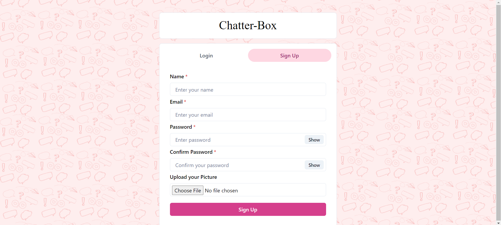
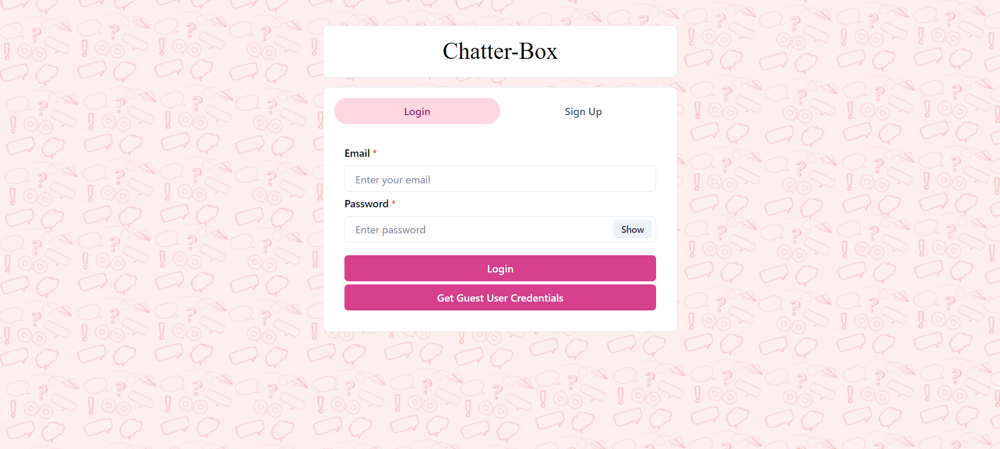
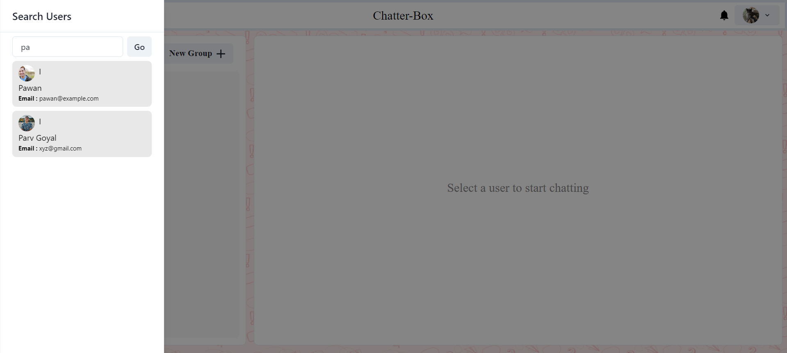
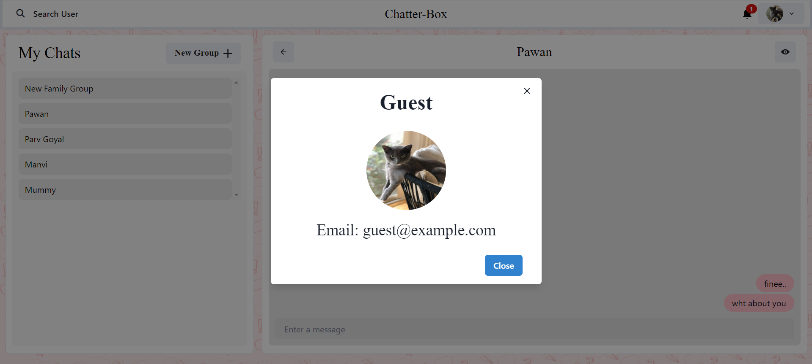
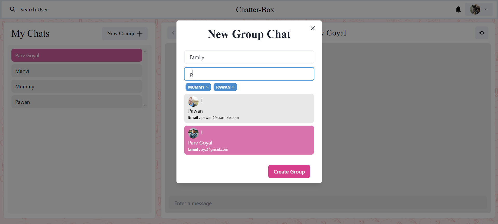
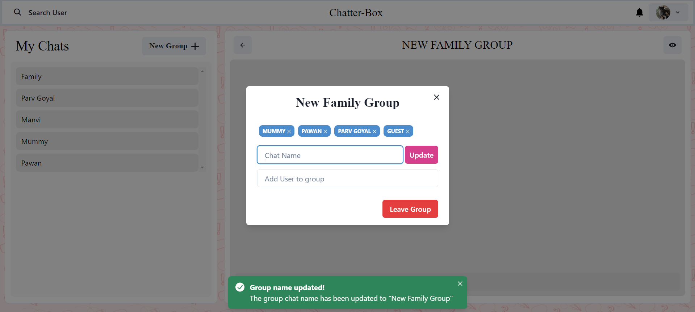
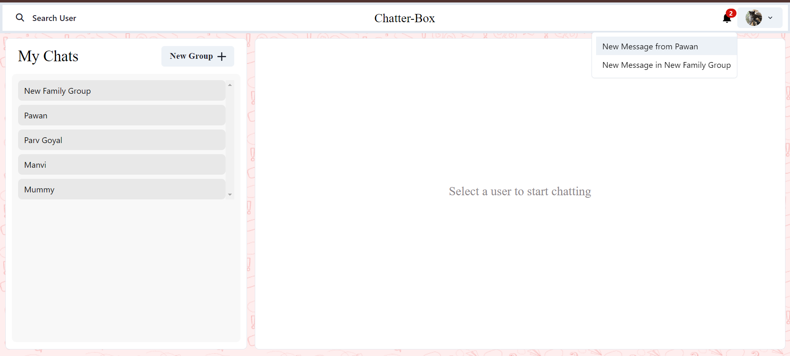
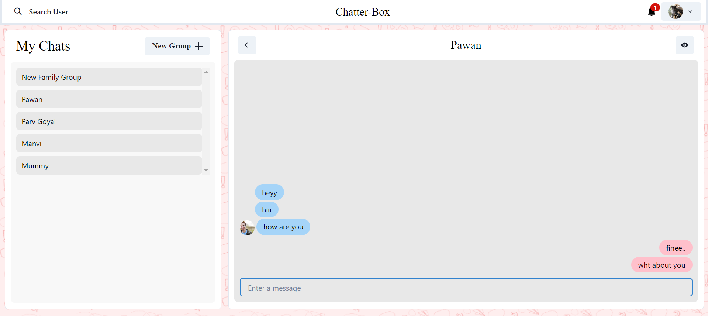

# Chatter Box - A Real-Time MERN Stack Chat Application

**Chatter Box** is a real-time chat application built using the MERN stack (MongoDB, Express.js, React.js, and Node.js). It allows users to communicate with each other through instant messaging and provides a seamless user experience with responsive design and secure authentication.

## Table of Contents

- [Features](#features)
- [Technologies Used](#technologies-used)
- [Installation](#installation)
- [Usage](#usage)
- [Screenshots](#screenshots)
  
## Features

- Real-time messaging powered by Socket.io
- Secure user authentication with JWT
- User-friendly interface to search for users and initiate chats
- Responsive design for desktop
- Password hashing for enhanced security using bcryptjs
- Image uploads and sharing via Cloudinary

## Technologies Used

- **Frontend**: React.js (with Chakra UI)
- **Backend**: Node.js with Express.js
- **Database**: MongoDB with Mongoose
- **Authentication**: JWT and bcryptjs
- **Real-Time Messaging**: Socket.io
- **File Uploads**: Cloudinary

## Installation

To set up the project locally, follow the instructions below:

1. **Clone the repository**:
   ```bash
   git clone https://github.com/your-username/chatter-box.git

2. **Navigate to the project folder**:
   ```bash
   cd chat-application
3. **Install backend dependencies**:
   ```bash
   npm install
4. **Navigate to the frontend directory and install frontend dependencies**:
   ```bash
   cd frontend
   npm install
5. **Set up environment variables**:
   ```bash
   MONGO_URI=your-mongodb-uri
   JWT_SECRET=your-jwt-secret
   CLOUDINARY_NAME=your-cloudinary-name
   CLOUDINARY_API_KEY=your-cloudinary-api-key
   CLOUDINARY_API_SECRET=your-cloudinary-api-secret

6. **Run the application**:
   ```bash
   npm start
7. **Start the frontend React app**:
   ```bash
   npm start

## Usage

- Sign up or log in to access their personal chat space.
- Search for users to initiate conversations or make group chats.
- Send and receive messages in real-time.
  
## Screenshots

Here’s a preview of **Chatter Box** in action:

### 1. Sign-Up Page
This page allows users to create an account by entering basic information such as name, email, and password.


### 2. Login Page
The login page allows users to securely log in with their credentials.


### 3. User Search Interface
This feature enables users to search for other registered users to initiate a conversation.


### 4. My Profile
Users can view their profile details, such as their name, email and profile picture.


### 5. Make Group
Users can create group chats, add multiple users, and chat with groups.


### 6. Update Group Info
Here, users can view update group name and add participants.


### 7. Notifications 
Users receive notifications for new personal or group messages


### 8. Chat Page
The core of the application, where users can send and receive real-time messages with other users.


